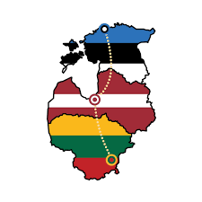

# Baltic Way

GPX track that follows along the [Baltic Way](https://en.wikipedia.org/wiki/Baltic_Way) based on the data from [thebalticway.eu](http://www.thebalticway.eu).

Contents:
- [trackpoints.json](trackpoints.json) – a file obtained from http://www.thebalticway.eu/_map/route.json
- [waypoints.json](waypoints.json) — a manually composed file that contains information about interesting places along the way, PULL REQUESTS WELCOME
- [trackpoints_to_gpx.sh](trackpoints_to_gpx.sh) – a script that generates the GPX file
- [baltic_way.gpx](baltic_way.gpx) – generated GPX file contains:
  - `<wpt>` for each waypoint
  - `<trk>` both ways (Vilnius – Riga – Tallinn and Tallinn – Riga – Vilnius)
